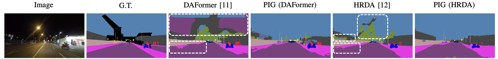

## PIG: Prompt Images Guidance for Night-time Scene Parsing
by Zhifeng Xie, Rui Qiu, Sen Wang, [Xin Tan*](https://tanxincs.github.io), Yuan Xie
## Overview


Night-time scene parsing aims to extract pixel-level semantic information in night images, aiding downstream tasks in understanding scene object distribution. Due to limited labeled night image datasets, **unsupervised domain adaptation (UDA)** has become the predominant method for studying night scenes. 
UDA typically relies on paired day-night image pairs to guide adaptation, but this approach hampers dataset construction and restricts generalization across night scenes in different datasets. Moreover, UDA, focusing on network architecture and training strategies, faces difficulties in handling classes with few domain similarities.

We leverage **Prompt Images Guidance (PIG)** to enhance UDA with supplementary night knowledge. We propose a **Night-Focused Network (NFNet)** to learn night-specific features from both target domain images and prompt images. To generate high-quality pseudo-labels, we propose **Pseudo-label Fusion via Domain Similarity Guidance (FDSG)**. We utilize the LPIPS to assess the domain similarity between day and night images for the single class.
Classes with fewer domain similarities are predicted by NFNet, which excels in parsing night features, while classes with more domain similarities are predicted by UDA, which has rich labeled semantics. Additionally, we propose two data augmentation strategies: the **Prompt Mixture Strategy (PMS)** and the **Alternate Mask Strategy (AMS)**, aimed at mitigating overfitting of the NFNet to a few prompt images.

We conduct extensive experiments on four night-time datasets: **NightCity**, **NightCity+**, **Dark Zurich**, and **ACDC**. The results indicate that utilizing PIG can enhance the parsing accuracy of UDA.



## Setup
This PIG (HRDA) code builds upon [MMSegmentation](https://github.com/open-mmlab/mmsegmentation) and [HRDA](https://github.com/lhoyer/HRDA). We highly recommend that you familiarize yourself with MMSegmentation and HRDA before exploring this code. Additionally, when running the code, it is natural to encounter issues, and referring to the baseline code issues may assist you in resolving them more expeditiously and effectively.

We use Python 3.8.16 and recommend setting up a new virtual environment:
```shell
conda create -n pig python=3.8.16
conda activate pig
```
In that environment, the requirements can be installed with:
```shell
pip install -r requirements.txt -f https://download.pytorch.org/whl/torch_stable.html
pip install -U openmim
mim install mmcv-full==1.3.7
```

Please refer to HRDA for MiT_b5 and data set download and data set processing. Please refer to [FDLNet](https://github.com/wangsen99/FDLNet) for NightCity. The final folder structure should look like this:

```shell
PIG
├── ...
├── pretrained
│   ├── mit_b5.pth
├── data
│   ├── acdc
│   │   ├── gt
│   │   │   ├── train
│   │   │   ├── val
│   │   ├── rgb_anon
│   │   │   ├── train
│   │   │   ├── val
│   ├── cityscapes
│   │   ├── leftImg8bit
│   │   │   ├── train
│   │   │   ├── val
│   │   ├── gtFine
│   │   │   ├── train
│   │   │   ├── val
│   ├── dark_zurich
│   │   ├── gt
│   │   │   ├── val
│   │   ├── rgb_anon
│   │   │   ├── train
│   │   │   ├── val
│   ├── nightcity
│   │   ├── gt
│   │   │   ├── train
│   │   │   ├── val
│   │   ├── img
│   │   │   ├── train
│   │   │   ├── val
│   ├── prompt
│   │   ├── gt
│   │   ├── img
```

Please note that the code is properly adjusted according to the prompt images you choose.

## Training & Testing
Let's take Cityscapes --> NightCity as an example and run it for training:
```shell
python run_experiments.py --config configs/pig/pig_city2nightcity.py
```

The results for Cityscapes --> ACDC and Cityscapes --> DarkZurich are reported on the test split of the target dataset. To generate the predictions for the test set, please run:
```shell
python tools/test.py path/to/config_file path/to/checkpoint_file --test-set --format-only --eval-option imgfile_prefix=labelTrainIds to_label_id=False
```
The predictions can be submitted to the public evaluation server of the respective dataset to obtain the test score.

## Checkpoints

| Method | Adaptation | mIoU | Config | Checkpoints |
| :---: | :---: | :---: | :---: | :---: |
| PIG (HRDA) | Cityscapes --> Dark Zurich  | 59.06 | [Config](https://drive.google.com/file/d/1Uzwt25Q39cNX58TqNXFWHIEMB-p6EgPz/view?usp=share_link) | [Checkpoints](https://drive.google.com/file/d/141oRrXr97Yj4gzc46lixWIDvtAdvAh-7/view?usp=share_link) |

## Citation
If you find this repo useful for your research, please consider citing our paper:
```
@article{xie2024PIG,
  title={PIG: Prompt Images Guidance for Night-Time Scene Parsing},
  author={Xie, Zhifeng and Qiu, Rui and Wang, Sen and Tan, Xin and Xie, Yuan and Ma, Lizhuang},
  journal={IEEE Transactions on Image Processing},
  year={2024},
  publisher={IEEE},
  doi={10.1109/TIP.2024.3415963}
}
```

## Acknowledgements

PIG is based on the following open-source projects. We thank their authors for making the source code publicly available.

* [DAFormer](https://github.com/lhoyer/DAFormer)
* [HRDA](https://github.com/lhoyer/HRDA)
* [MMSegmentation](https://github.com/open-mmlab/mmsegmentation)
* [SegFormer](https://github.com/NVlabs/SegFormer)
* [DACS](https://github.com/vikolss/DACS)
* [SHADE](https://github.com/HeliosZhao/SHADE)

## License

This project is released under the [Apache License 2.0](LICENSE), while some specific features in this repository are with other licenses. Please refer to
[LICENSES.md](LICENSES.md) for the careful check, if you are using our code for commercial matters.
